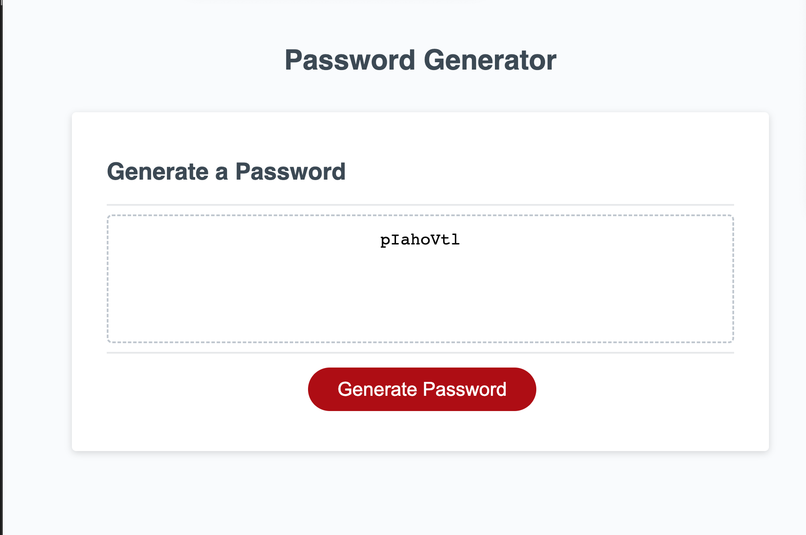

# password-generator

#Challenge 3 Password Generator

The purpose of this challenge was to create a password generator for users
#Horiseon Homepage

##Description

This project is a random password generator. The program uses JavaScript to prompt the user to specify a password length (8-128 characters) and which types of characters they would like their password to comprise (numbers, special characters, uppercase letters, and lowercase letters).

The user will answer 4 prompts asking about specific characteristics they would like their password. At the end of the whole process they will have a password that meets their own requirements.

##Installation

N/A

##Usage

The website provides information for users about my skill set, projects, and contact information.

##Credits

just me

## License

MIT
